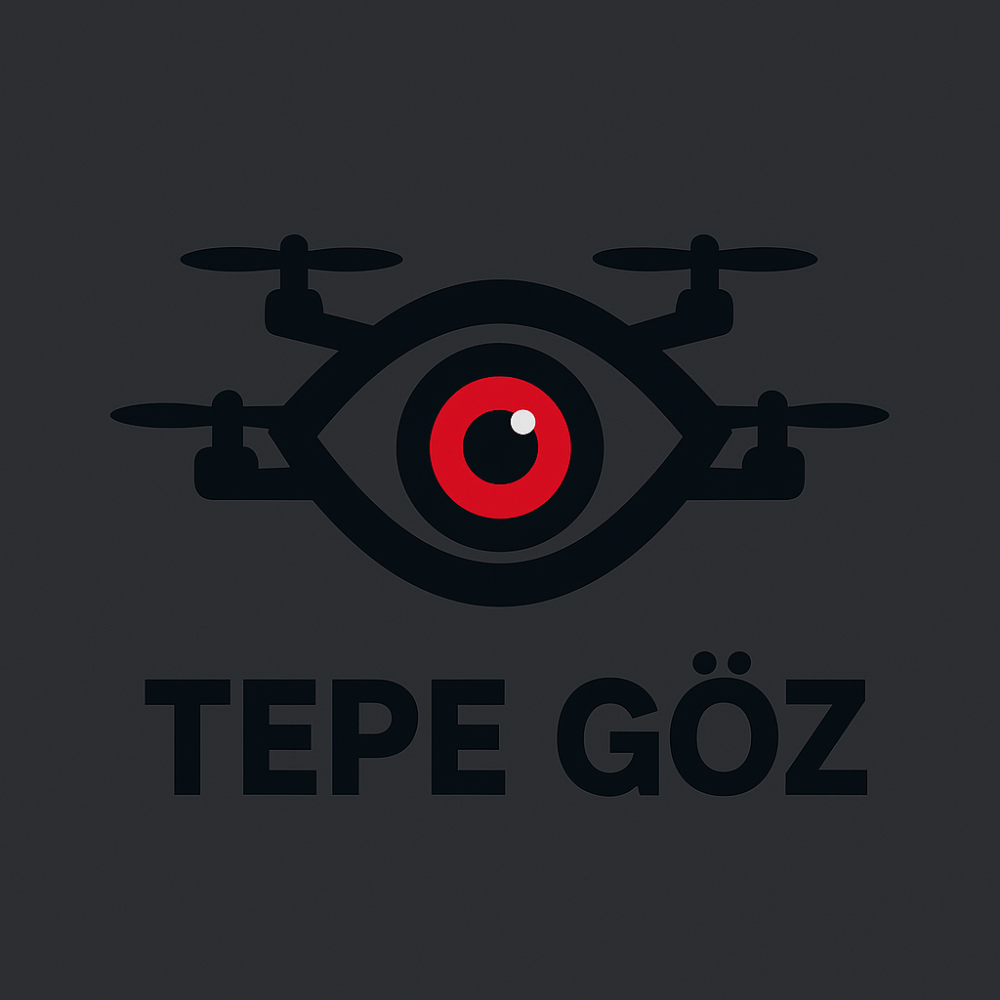
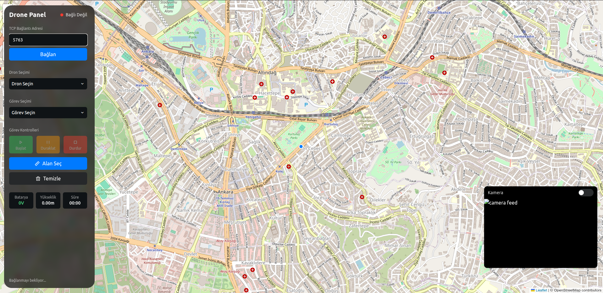
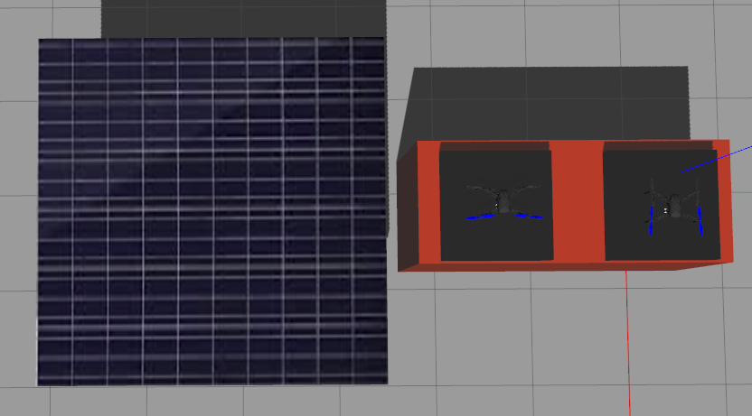
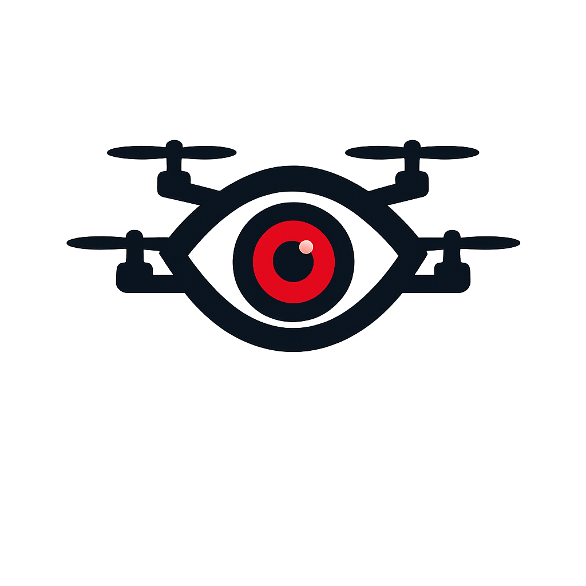

# Tepe Göz

<p align="center">
  
</p>

## Continuous Autonomous Surveillance System with Multi-Drone and Ground Station

This project, named "Tepe Göz" (Hill Eye), is a multi-drone continuous surveillance system designed for 24/7 autonomous monitoring of a designated area. The system combines a ground station, a solar charging unit, and at least two drones to ensure uninterrupted observation.

### Project Overview

The core of the system is the ability to perform continuous, round-the-clock surveillance. One drone is always in the air, performing a predefined mission (e.g., fire detection, human detection, motion detection), while the other drone is on the ground, charging its battery from the solar-powered station. When the active drone's battery level drops to a critical point, it autonomously returns to the ground station to charge. Simultaneously, the newly charged drone takes off to continue the surveillance mission without any interruption.

This seamless handover mechanism ensures that the monitored area is never left unguarded. The system is equipped with AI-powered detection capabilities to identify specific events or objects (e.g., fires, intruders) and alert the ground station. The ground station then sends notifications to relevant personnel, providing real-time information and camera feeds.

### Key Features

  * **24/7 Continuous Surveillance:** A multi-drone rotation system ensures a seamless transition between drones, guaranteeing uninterrupted observation.
  * **Autonomous Operation:** Drones can autonomously take off, follow a mission path, return to the ground station for charging, and land.
  * **Solar-Powered Charging:** The ground station utilizes a solar panel and a battery unit to provide sustainable, off-grid charging for the drones.
  * **AI-Powered Detection:** The system uses YOLOv8 models to perform real-time object detection (e.g., fire, human, enemy).
  * **Ground Station Monitoring:** A web-based interface provides real-time drone status, mission progress, battery levels, and live camera feeds.
  * **ROS1 Integration:** The entire system is built on ROS1 (Robot Operating System) Noetic, running on Ubuntu 20.04, for robust communication and control.
  * **User-Friendly Interface:** The Flask-based web server and Leaflet map provide an intuitive interface for mission planning and status monitoring.

### Technical Stack

  * **Operating System:** Ubuntu 20.04
  * **ROS:** ROS1 Noetic
  * **Programming Language:** Python 3.8.10
  * **Drone Framework:** `dronekit`
  * **Computer Vision:** `ultralytics` (YOLOv8)
  * **Web Server:** `Flask`
  * **Frontend:** HTML, CSS (TailwindCSS), JavaScript, `Leaflet.js` for mapping
  * **Dependencies:**
      * `rospy` (from ROS1)
      * `dronekit`
      * `flask`
      * `ultralytics`
      * `numpy`
      * `opencv-python`
      * `Pillow`
      * `pymavlink`

### Project Structure

```
tepe_goz/
├── app.py                      # Main Flask application and API endpoints
├── config.py                   # Configuration file for drone and mission parameters
├── modules/
│   ├── camera_ai.py            # Handles camera feeds and AI detection logic
│   ├── drone_manager.py        # Manages drone connections and status
│   ├── fire_detector.py        # Specific module for fire detection using YOLOv8
│   ├── mission_controller.py   # Manages mission planning and execution
│   └── ...                     # Other detection modules (e.g., human_detector)
├── static/
│   ├── css/
│   │   └── style.css
│   ├── images/
│   │   ├── logo5.png           # Project logo
│   │   └── ...                 # Other images (dron_istansoy.png, dron_istayon2.png)
│   └── js/
│       └── script.js           # Frontend JavaScript for map and UI
├── templates/
│   └── index.html              # Main web interface
├── models/
│   └── fire_m.pt               # Pre-trained YOLOv8 model for fire detection
├── README.md                   # This file
└── ...
```

### Installation and Setup

  * **Prerequisites:** Ubuntu 20.04, ROS1 Noetic, Python 3.8.10
  * Clone the repository:
    ```bash
    git clone https://github.com/your-username/tepe_goz.git
    cd tepe_goz
    ```
  * Install Python dependencies:
    ```bash
    pip install -r requirements.txt
    ```
  * Set up ROS environment and run the ROS core.
  * Run the main application:
    ```bash
    python app.py
    ```

### Screenshots

| Ground Station and Web Interface | Solar Charging Station |
| :---: |:---:|
|  |  |

### Tepe Göz

\<p align="center"\>
\
\</p\>

## Çoklu Drone ve Yer İstasyonlu Kesintisiz Otonom Gözetim Sistemi

"Tepe Göz" adlı bu proje, belirli bir alanın 7/24 kesintisiz otonom gözetimini sağlamak için tasarlanmış çoklu bir drone gözetim sistemidir. Sistem, kesintisiz gözlem sağlamak için bir yer istasyonu, bir güneş enerjisi şarj ünitesi ve en az iki drone'u bir araya getirir.

### Proje Amacı

Sistemin temel amacı, 24 saat kesintisiz gözetim yapma yeteneğidir. Her zaman bir drone havada, önceden tanımlanmış bir görevi (örneğin, yangın tespiti, insan tespiti, hareket tespiti) gerçekleştirirken, diğer drone yerdeki güneş enerjisiyle çalışan istasyonda bataryasını şarj eder. Aktif drone'un batarya seviyesi kritik bir seviyeye düştüğünde, şarj olmak için otonom olarak yer istasyonuna döner. Eş zamanlı olarak, yeni şarj olmuş drone havalanarak gözetim görevine herhangi bir kesinti olmadan devam eder.

Bu sorunsuz görev devir teslim mekanizması, gözlemlenen alanın asla gözetimsiz kalmamasını sağlar. Sistem, yapay zeka destekli tespit yetenekleriyle belirli olayları veya nesneleri (örneğin yangınlar, davetsiz misafirler) tanımlayabilir ve yer istasyonunu uyarabilir. Yer istasyonu da gerçek zamanlı bilgi ve kamera beslemesini ilgili kişilere bildirir.

### Ana Özellikler

  * **7/24 Kesintisiz Gözetim:** Çoklu drone rotasyon sistemi, dronelar arasında sorunsuz bir geçiş sağlayarak kesintisiz gözlem garantisi verir.
  * **Otonom Operasyon:** Dronelar otonom olarak havalanabilir, görev yolunu takip edebilir, şarj olmak için yer istasyonuna dönebilir ve iniş yapabilir.
  * **Güneş Enerjisiyle Şarj:** Yer istasyonu, dronelar için sürdürülebilir ve şebekeden bağımsız şarj sağlamak üzere bir güneş paneli ve akü ünitesi kullanır.
  * **Yapay Zeka Destekli Tespit:** Sistem, gerçek zamanlı nesne tespiti (örneğin yangın, insan, düşman) yapmak için YOLOv8 modellerini kullanır.
  * **Yer İstasyonu İzleme:** Web tabanlı bir arayüz, gerçek zamanlı drone durumu, görev ilerlemesi, batarya seviyeleri ve canlı kamera görüntülerini sunar.
  * **ROS1 Entegrasyonu:** Tüm sistem, sağlam iletişim ve kontrol için Ubuntu 20.04 üzerinde çalışan ROS1 (Robot İşletim Sistemi) Noetic üzerine kurulmuştur.
  * **Kullanıcı Dostu Arayüz:** Flask tabanlı web sunucusu ve Leaflet haritası, görev planlaması ve durum izleme için sezgisel bir arayüz sağlar.

### Teknik Gereksinimler

  * **İşletim Sistemi:** Ubuntu 20.04
  * **ROS:** ROS1 Noetic
  * **Programlama Dili:** Python 3.8.10
  * **Drone Kütüphanesi:** `dronekit`
  * **Bilgisayarlı Görü:** `ultralytics` (YOLOv8)
  * **Web Sunucusu:** `Flask`
  * **Ön Yüz:** HTML, CSS (TailwindCSS), JavaScript, haritalama için `Leaflet.js`
  * **Gerekli Kütüphaneler:**
      * `rospy` (ROS1'den)
      * `dronekit`
      * `flask`
      * `ultralytics`
      * `numpy`
      * `opencv-python`
      * `Pillow`
      * `pymavlink`

### Proje Dosyaları

```
tepe_goz/
├── app.py                      # Ana Flask uygulaması ve API uç noktaları
├── config.py                   # Drone ve görev parametreleri için yapılandırma dosyası
├── modules/
│   ├── camera_ai.py            # Kamera beslemesini ve yapay zeka tespit mantığını yönetir
│   ├── drone_manager.py        # Drone bağlantılarını ve durumunu yönetir
│   ├── fire_detector.py        # YOLOv8 kullanarak yangın tespiti için özel modül
│   ├── mission_controller.py   # Görev planlamasını ve yürütülmesini yönetir
│   └── ...                     # Diğer tespit modülleri (örn. human_detector)
├── static/
│   ├── css/
│   │   └── style.css
│   ├── images/
│   │   ├── logo5.png           # Proje logosu
│   │   └── ...                 # Diğer görseller (dron_istansoy.png, dron_istayon2.png)
│   └── js/
│       └── script.js           # Harita ve kullanıcı arayüzü için ön yüz JavaScript'i
├── templates/
│   └── index.html              # Ana web arayüzü
├── models/
│   └── fire_m.pt               # Yangın tespiti için önceden eğitilmiş YOLOv8 modeli
├── README.md                   # Bu dosya
└── ...
```

### Kurulum ve Çalıştırma

  * **Ön Koşullar:** Ubuntu 20.04, ROS1 Noetic, Python 3.8.10
  * Depoyu klonlayın:
    ```bash
    git clone https://github.com/your-username/tepe_goz.git
    cd tepe_goz
    ```
  * Python bağımlılıklarını kurun:
    ```bash
    pip install -r requirements.txt
    ```
  * ROS ortamını kurun ve ROS core'u çalıştırın.
  * Ana uygulamayı çalıştırın:
    ```bash
    python app.py
    ```

### Ekran Görüntüleri

| Yer İstasyonu ve Web Arayüzü | Güneş Enerjili Şarj İstasyonu |
| :---: |:---:|
|  |  |
